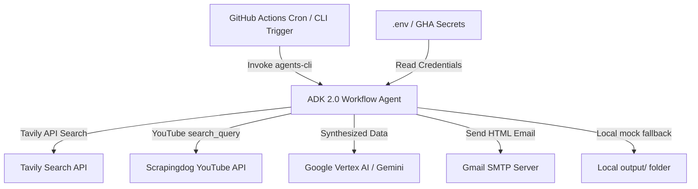

# STRIDE Threat Modeling Assessment
**Project Name**: Antigravity AI & Tech Premium Digest Agent V2.0
**Date**: June 21, 2026

This document presents a systematic STRIDE threat modeling assessment of the Antigravity Premium Digest Agent architecture, boundaries, and codebase.

---

## 1. System Boundaries & Data Flow

### Entry Points
- Local execution via CLI: `agents-cli run "Trigger Daily Digest"`
- Scheduled execution via GitHub Actions cron: `0 7 * * *` (IST)

### Data Storage Layers
- Local filesystem for mock fallback outputs (`output/digest_<date>.html`)
- Memory variables during active graph traversal (context state)

---

## 2. STRIDE Assessment

| Threat Category | Potential Threat / Risk | Mitigations / Current Controls | Recommendations |
| :--- | :--- | :--- | :--- |
| **Spoofing** | Unauthorized execution of the workflow disguised as the system runner. | The workflow is restricted to local user processes and private GitHub Action runners. There is no publicly exposed user authentication endpoint. | If deploying the FastAPI app, implement OAuth2/Bearer token validation to protect the invocation endpoints. |
| **Tampering** | Malicious injection of inputs to alter search queries or corrupt the generated HTML. | Search queries are static, hardcoded strings in `app/agent.py`. All sensitive configuration inputs are loaded from local environment variables. | Sanitize incoming search query variables if we ever dynamicize them based on user input. |
| **Repudiation** | Inability to trace executed digest runs, delivery failures, or credential errors. | The app integrates standard telemetry (`setup_telemetry`) and GCP Cloud Logging (`google-cloud-logging`). Local CLI runs output detailed status events. | Ensure all SMTP errors and third-party API status codes are logged with appropriate severity levels. |
| **Information Disclosure** | Accidental exposure of API tokens, app passwords, or target recipient email addresses. | Secrets are configured in a `.env` file that is explicitly ignored in git (`.gitignore`). GitHub Actions workflow uses repository-level encrypted secrets. | Ensure that raw API response objects and exception tracebacks (which might contain keys) are not leaked in log outputs. |
| **Denial of Service** | Exhaustion of third-party API quotas (Tavily, Scrapingdog, Gemini, SMTP) due to loop execution or spamming. | The workflow is a scheduled task running once per day, mitigating runaway request risk. API calls use standard `httpx` timeouts (15–20s). | If exposing the FastAPI endpoint, implement rate-limiting (e.g., using `slowapi`) to prevent request spamming. |
| **Elevation of Privilege** | An unprivileged local system process hijacking the executing environment to run arbitrary code. | The agent runs entirely under the security scope of the logged-in system user or isolated GHA worker container. | Adhere to the Principle of Least Privilege: ensure the Google Cloud service account used for Vertex AI has only the `Vertex AI User` role. |

---

## 3. Security Check Verification
We successfully executed `agents-cli lint` in the project directory, confirming:
- **Ruff Linter**: `All checks passed!`
- **Ruff Formatter**: `9 files already formatted`
- **Codespell**: Clean, no typos.
- **Ty Type Checker**: `All checks passed!`
